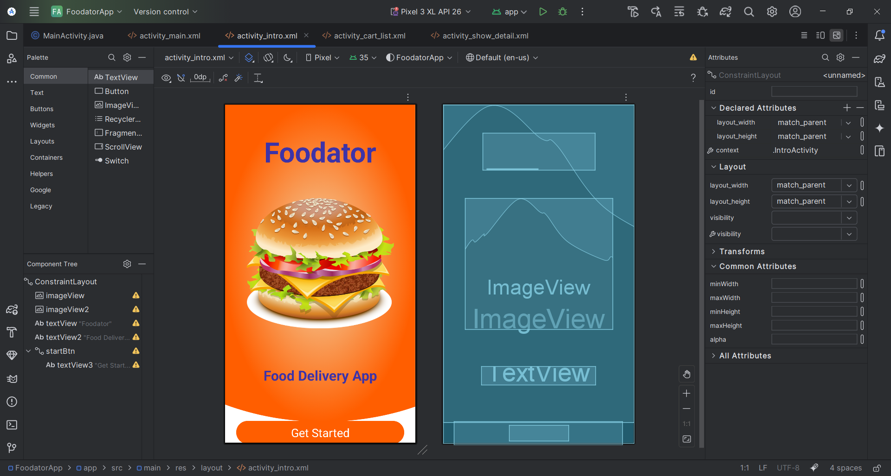
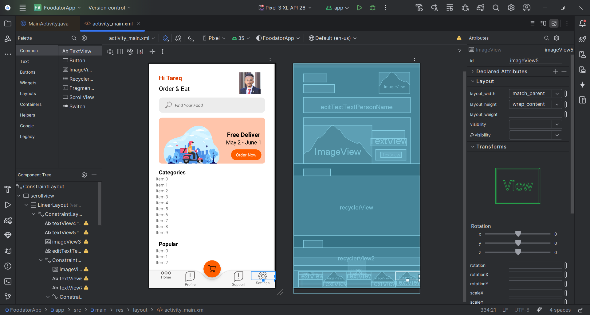
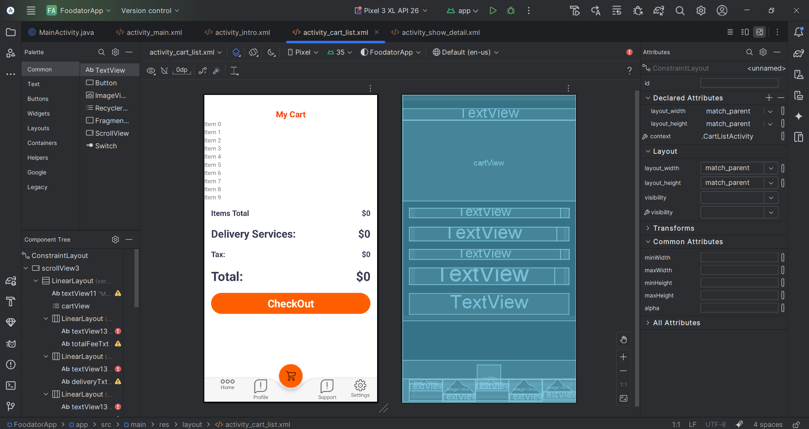
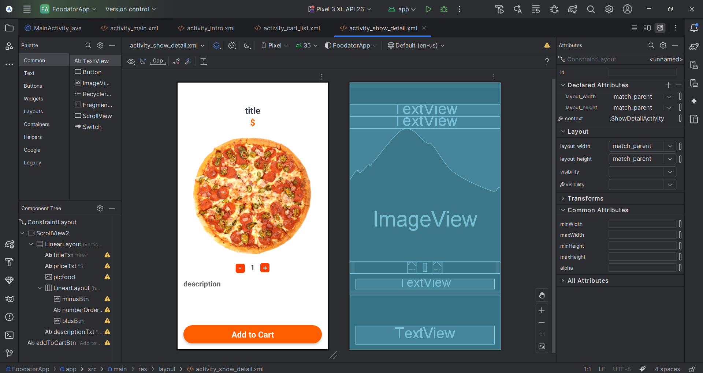
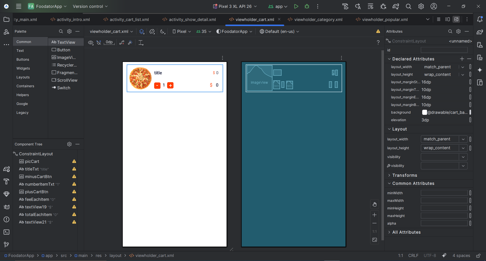
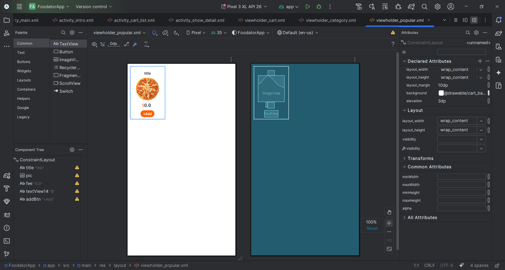

<h1 align="center">
  <a href="https://raw.githubusercontent.com/Amonjr/Java-Food-Delivery-Application/" target="_blank" align="center">
    Java Food Delivery Application 🍔
  </a>
</h1>

<p align="center">
  An Android-based food delivery app built with Java and XML, featuring menu browsing, order placement, and tracking.
</p>

<p align="center">
    <a href="https://github.com/Amonjr/Java-Food-Delivery-Application/LICENSE"></a>
    <a href="https://github.com/Amonjr/Java-Food-Delivery-Application/releases/"></a>
    <a href="https://github.com/Amonjr/Java-Food-Delivery-Application/stargazers"></a>
    <a href="https://github.com/Amonjr/Java-Food-Delivery-Application/network/members"></a>
    <a href="https://github.com/Amonjr/Java-Food-Delivery-Application/issues"></a>
    
    <!-- Removed Twitter Badge -->
</p>

<p align="center">
    <a href="docs/assets/Screenshot_1.png"></a>
</p>

## Introduction 🚀

This repository contains a **Food Delivery Application** built with Java and XML using Android Studio. The project is designed to showcase the core features of a modern mobile food delivery platform, providing a seamless user experience for browsing menus, placing orders, and tracking deliveries.

A native Android food delivery app featuring:

* **Menu Catalog**: Browse restaurants and menu items presented with images, descriptions, and prices.
* **Cart & Ordering**: Add items to cart, view details, and place orders.
* **Order Tracking**: Monitor live status updates (e.g., “Preparing”, “On the way”, “Delivered”).
* **Future Plans**: Add cart history, user onboarding, payment gateways, varied food categories (veg/non‑veg/desserts), and online payments.

## Tech Stack 🛠️

* **Language**: Java
* **UI**: Android XML layouts
* **IDE**: Android Studio

## Topics Covered ✔️


## Screenshots












## How to Run Locally ⚙️

1. Clone the repository:

   ```bash
   git clone https://github.com/Amonjr/Java-Food-Delivery-Application.git
   ```
2. Open in Android Studio.
3. Sync Gradle and build the app.
4. Run on an emulator or physical device.

## Contributing 🤝

Contributions, bug reports, and feature suggestions are welcome!
Please open an issue or submit a pull request.

## Author 🙋‍♂️

**Amonjr**   [GitHub](https://github.com/Amonjr)

## License 📜

This project is open-source and available under the [MIT License](LICENSE).

---

> If you found this helpful, don't forget to **star** the repo and share it with others! ⭐
